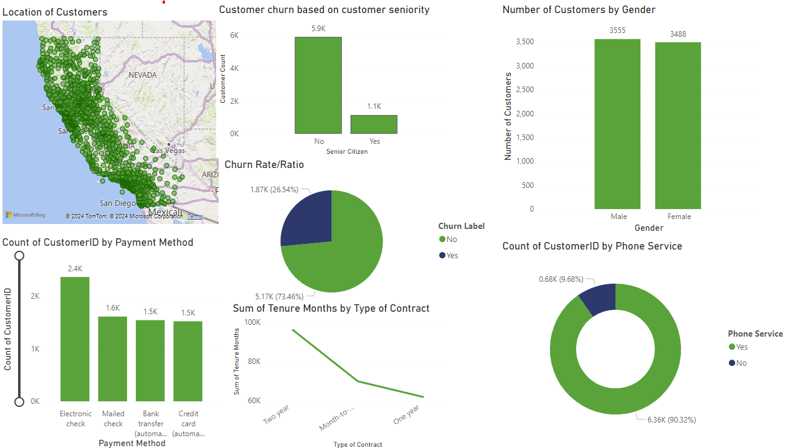

# Telco IBM Customer Churn Analysis

### Setup Instructions

Make an evironment in terminal using the below code:

python -m venv venv              

Activate the terminal:

venv\Scripts\activate

Install all required packaged using this command:

pip install -r .\requirements.txt

## Introduction

Customer churn refers to the rate at which customers stop doing business with a company. It’s a critical metric, particularly for subscription-based and service-oriented industries like telecommunications, where retaining customers directly impacts long-term profitability and growth. High churn rates can signal dissatisfaction with the product, poor customer support, or ineffective engagement strategies, all of which contribute to declining revenue.

In the telecommunications sector, reducing customer churn is crucial due to high customer acquisition costs. Retaining an existing customer is often significantly cheaper than acquiring a new one. Therefore, understanding the drivers of churn and predicting which customers are likely to churn enables companies to take proactive measures. This project focuses on identifying those key factors and predicting churn using data from IBM’s Telco Customer Churn dataset, ultimately offering insights to help businesses design effective retention strategies.

## Business Goal

<!-- Provide an X value do further analysis -->
The primary goal of this project is to reduce customer churn by leveraging data-driven insights. By analyzing customer behavior and building predictive models, the company aims to identify at-risk customers early and implement targeted retention strategies. This will not only improve customer satisfaction and loyalty but also increase the company’s customer lifetime value (CLTV) and overall profitability. Through this analysis, the business seeks to decrease churn by X% over the next year, ultimately driving growth and reducing the costs associated with customer acquisition.

## Insights

<!-- Include dashboard over here -->

### Main reasons for churn rate?

### Where is churn seen the most? 

### What segment of the population churns the most?

